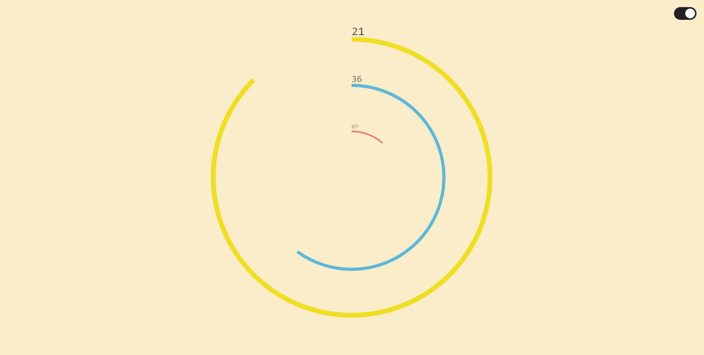
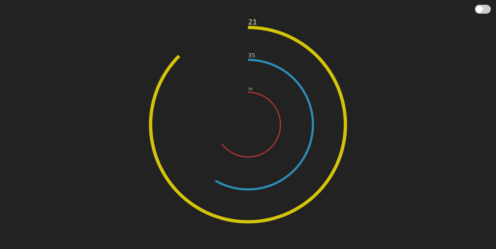

# circle-clock

A simple self contained html site displaying a circular clock.

A live example can be found at: <https://shemnei.github.io/circle-clock/>

## Running It

Simply open the [index.html](index.html) with a browser.

## Themes

